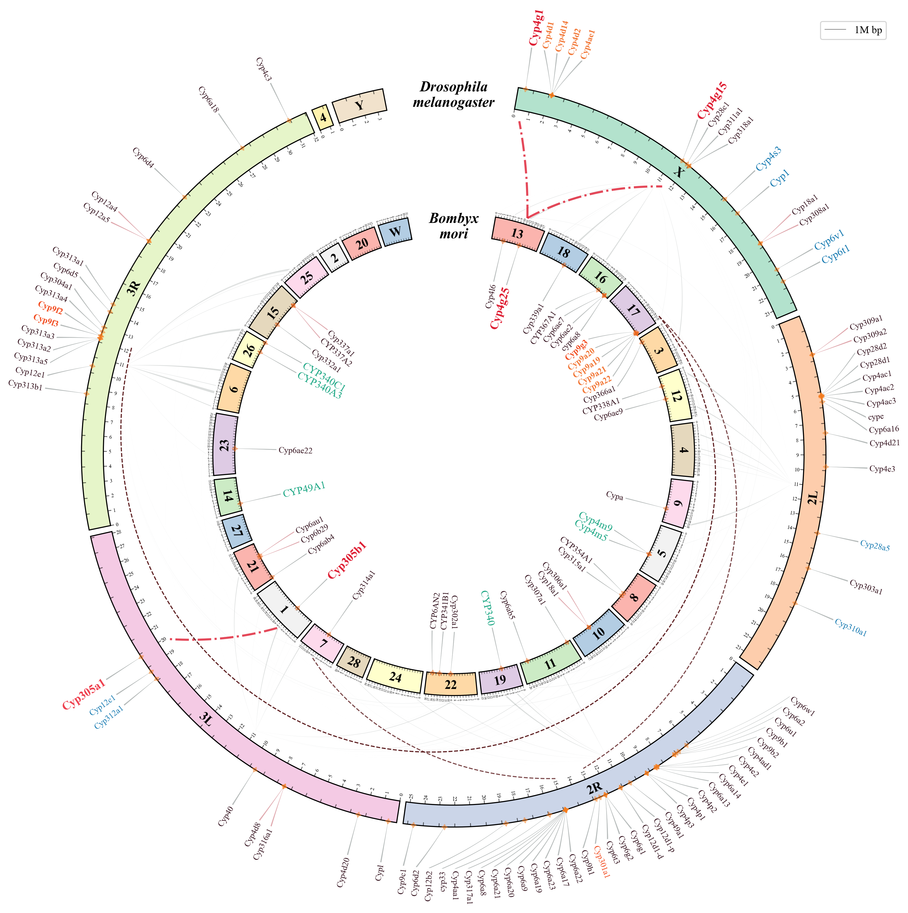
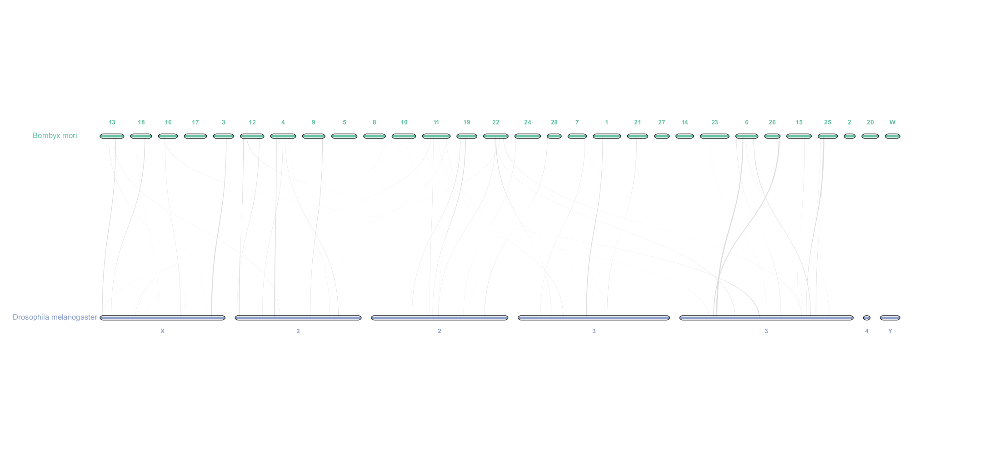

# **pyCircle: A Python Tool for Circular Visualization in Comparative Genomics**

**pyCircle** is a Python-based tool for creating circular visualizations in comparative genomics. It leverages [Matplotlib](https://matplotlib.org/) extensively and offers high customization capabilities.

**pyCircle** is implemented as a Jupyter Notebook file, which you can find [here](./pyCircle.ipynb). It was inspired by [pyCirclize](https://github.com/moshi4/pyCirclize), [circlize](https://github.com/jokergoo/circlize), and the "Advanced Circos" function in [TBtools](https://onlinelibrary.wiley.com/doi/10.1002/imt2.35). To create your own circular visualizations, you'll need to manually modify the source code within the `./pyCircle.ipynb` file.

## Key Features

> version 0.1

- [x] **Parsing**: Supports parsing of `.anchors.simple` files generated by [MCscan (Python version)](https://github.com/tanghaibao/jcvi/wiki/MCscan-(Python-version)).
- [x] **Linking**: Enables drawing links (blocks or lines) between two species.
- [x] **😄Non-overlapping Genomic Labels**: Ensures that genomic labels are displayed without overlapping, enhancing readability and clarity.
- [x] **Chromosome Length Scale**: Provides a scale for chromosome lengths, enabling accurate representation and comparison of genomic regions.

The figure above shows an example of a circular visualization created using pyCircle, the figure below shows a simple visualization using MCscan (Python version) in JCVI.

I encourage you to explore and customize the code to suit your specific needs. Enjoy creating beautiful visualizations (๑•̀ㅂ•́)و✧

If you encounter any issues or have suggestions for improvements, please feel free to open issues or submit pull requests😉

## Getting Started

1. **Prerequisites**: Ensure you have Python installed along with Matplotlib and other dependencies (Times New Roman font for example) in the environment.
2. **Installation**: Clone this repository.
3. **Usage**: Open the `pyCircle.ipynb` file in Jupyter Notebook and modify the code according to your dataset and visualization requirements.

## License

This project is licensed under [the MIT License](https://opensource.org/license/mit), see the [LICENSE](./LICENSE) file for details.

## References

1. Shimoyama, Y. (2022). pyCirclize: Circular visualization in Python [Computer software]. https://github.com/moshi4/pyCirclize
2. Gu, Z., Gu, L., Eils, R., Schlesner, M., & Brors, B. (2014). circlizeimplements and enhances circular visualization in R. Bioinformatics, 30(19), 2811–2812. https://doi.org/10.1093/bioinformatics/btu393
3. Chen, C., Wu, Y., & Xia, R. (2022). A painless way to customize Circos plot: From data preparation to visualization using TBtools. iMeta, 1(3). https://doi.org/10.1002/imt2.35
4. Tang, H., Krishnakumar, V., Zeng, X., Xu, Z., Taranto, A., Lomas, J. S., . . . Zhang, X. (2024). JCVI: A versatile toolkit for comparative genomics analysis. iMeta. https://doi.org/10.1002/imt2.211
